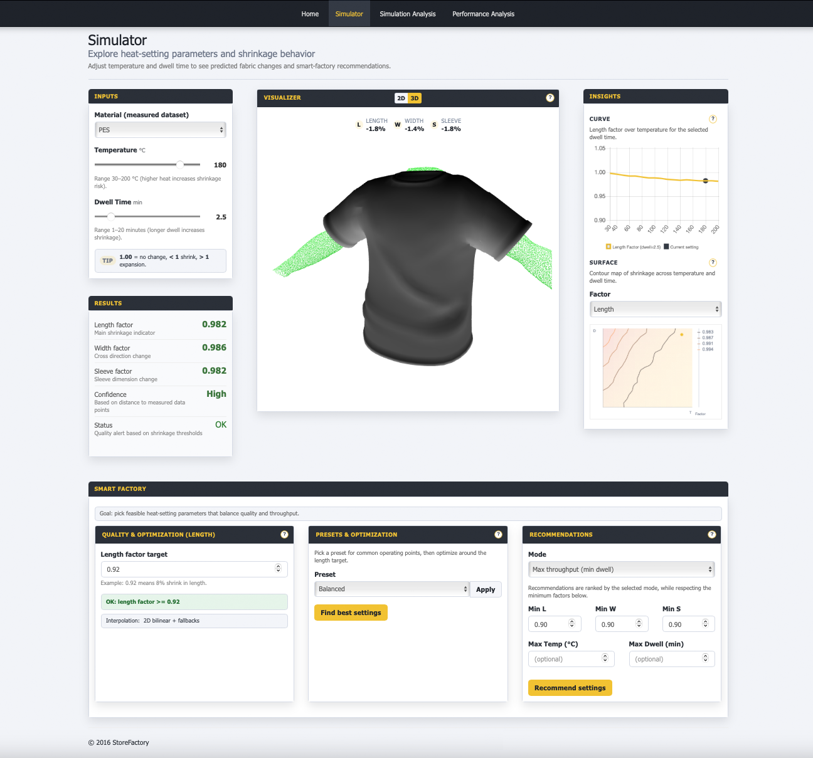
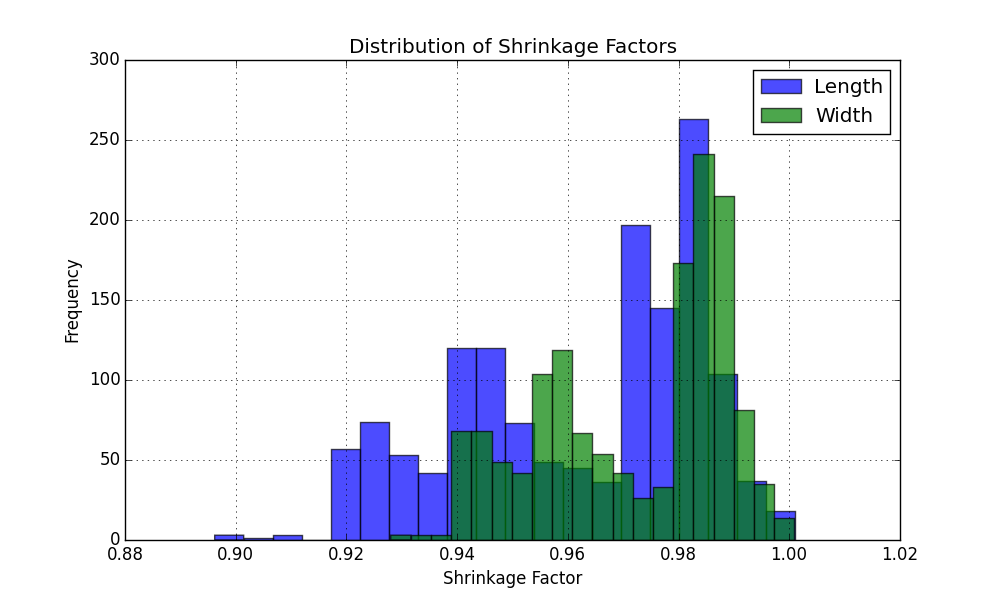
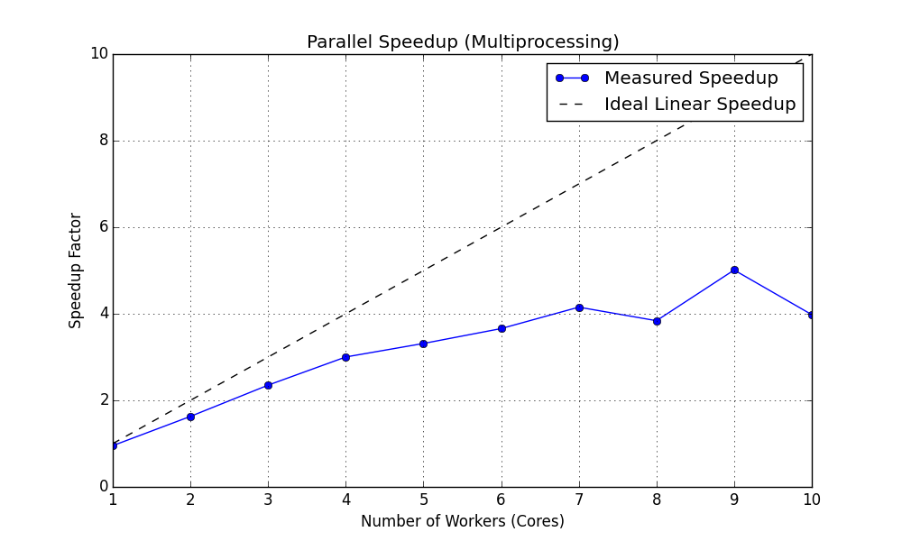
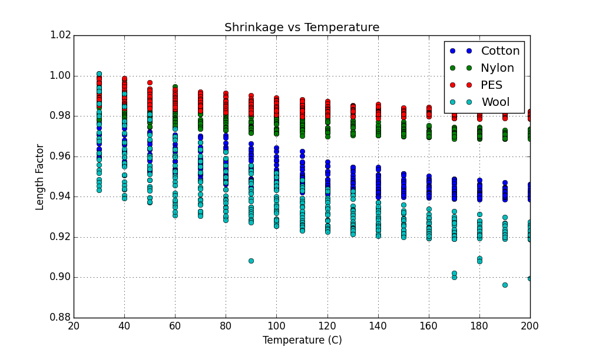

# StoreFactory: Digital Lab for Textile Heat-Setting Simulation

<p align="center">
  
  &nbsp;&nbsp;&nbsp;&nbsp;
  
</p>

**Master Thesis:** Increasing Performance of the Textile Production Chain Applied to the StoreFactory Project  
**Institution:** RWTH Aachen University  
**Status:** Final

> **Note on scope:** This repository represents an extended version of what was submitted as the final thesis deliverable. It includes additional documentation, figures, scripts, and refinements that were not included in the formal submission due to administrative and practical constraints.

## Submission Metadata

The work was submitted to the **Institut für Textiltechnik (ITA)** of **RWTH Aachen University**.

- **Title:** Increasing Performance of the Textile Production Chain Applied to the StoreFactory Project  
- **Presented as:** Master Thesis  
- **Chair / 1st examiner:** Univ.-Prof. Prof. h.c. (MGU) Dr.-Ing. Dipl.-Wirt. Ing. Thomas Gries  
- **2nd examiner:** Dr.-Ing. Dieter Veit  
- **Supervisor:** Maximilian Kemper, M.Sc.  
- **Place / Date:** Aachen, November 2016  

---

## Abstract

The **StoreFactory Web Simulator** is a web-based **Digital Twin** platform designed to bridge the gap between empirical material science and automated textile production. By simulating the shrinkage behavior of various fabrics under different heat-setting conditions (Temperature and Dwell Time), this tool enables production engineers to predict dimensional changes before physical processing.

The application serves as a "Digital Lab," allowing for the visualization of material deformations on 3D models and the optimization of process parameters to meet strict quality standards while maximizing throughput.


*Figure 1: Interactive Web Simulator Dashboard*

## Key Features

### 1. Predictive Simulation Engine
*   **Real-time Calculation:** Instantly predicts Length, Width, and Sleeve shrinkage factors based on user inputs.
*   **Bilinear Interpolation:** Uses a mathematical model to estimate values between discrete measurement points, ensuring smooth continuous predictions from sparse empirical data.

### 2. Interactive 3D Visualization
*   **WebGL Rendering:** Utilizes **Babylon.js** to render a 3D mannequin and T-shirt model directly in the browser.
*   **Dynamic Scaling:** Visually represents shrinkage by applying calculated factors to the 3D meshes in real-time, providing immediate visual feedback on product fit.

### 3. Smart Factory Optimization
*   **Constraint Solving:** Automatically searches for optimal process parameters (Temperature/Time) to achieve a specific target shrinkage (e.g., "Length Factor 0.92").
*   **Recommendation Algorithms:** Suggests operating points ranked by criteria such as **Max Throughput** (minimizing dwell time) or **Min Energy** (minimizing temperature).

### 4. Data Analytics
*   **Statistical Insights:** Integrated Python pipeline processes raw measurement CSV data to generate histograms, risk indices, and stability grids.

    
    *Figure 2: Distribution of Shrinkage Factors across Material Batches*

*   **High-Performance Computing:** Implements a **Parallel Computing Pipeline** (using Python `multiprocessing`) to benchmark data aggregation performance. It calculates speedup, efficiency, and overhead metrics across multiple CPU cores to demonstrate scalability.

    
    *Figure 3: Parallel Speedup vs. Number of Workers*

*   **Visualization:** Interactive charts and surface plots help identify stable process windows.

## Technical Architecture

The project is built as a cross-platform web application:

*   **Backend:** ASP.NET Core 1.1 (C#) using MVC architecture.
*   **Frontend:** Bootstrap 3.3.7, jQuery 2.2.4, Babylon.js (WebGL).
*   **Data Processing:** Python scripts for offline analysis of measurement datasets.
*   **Data Storage:** In-memory mock database seeded from CSV files (`data/measurements.csv`).

### Project Structure

*   `StoreFactory.Web/`: Main ASP.NET Core application.
    *   `Controllers/`: Logic for simulation and optimization.
    *   `Services/`: Mathematical engines (`ShrinkageCalculator`).
    *   `wwwroot/`: Static assets (JS, CSS, 3D models).
*   `analysis/`: Python scripts for data processing.
*   `data/`: Raw CSV measurements and generated JSON analysis files.

## Getting Started

### Prerequisites
*   .NET Core 1.1 SDK (or compatible runtime).
*   Python 2.7 or 3.x (optional, for running analysis scripts).

### Installation & Run
1.  Clone the repository.
2.  Navigate to the web project: `cd StoreFactory.Web`.
3.  Restore dependencies: `dotnet restore`.
4.  Run the application: `dotnet run`.
5.  Open `http://localhost:5000` in your web browser.

### Reproducibility (Experiments & Figures)

#### 1) Run automated tests
From the repository root:

```bash
dotnet test
```

#### 2) Regenerate analysis figures
The plots committed under `docs/img/` are generated by the analysis pipeline.

```bash
python analysis/generate_figures.py
```

The script reads input datasets from `data/` and writes updated figures into `docs/img/`.

#### 3) Synthetic dataset for parallel computing benchmarks
To benchmark the scaling behavior of the analysis pipeline without relying on proprietary measurement data, a synthetic dataset is used.

- **Source file:** `data/synthetic_large.csv`
- **Purpose:** Stress-test aggregation and preprocessing with a large number of rows.

**Generation / reproducibility note.** A generator script for `synthetic_large.csv` is not currently part of this repository. The dataset is included as a static artifact so that the benchmark results and figures can be reproduced from a clean checkout without requiring additional tooling.

If you want a *fully reproducible* workflow, you can instead generate a deterministic measurement dataset and then point the benchmark to it:

- Generate `data/measurements.csv` (deterministic with fixed seed):

  ```bash
  python scripts/generate_dataset.py
  ```

- Update the benchmark input in `analysis/compute_parallel.py` by changing:

  `IN_CSV = os.path.join(DATA_DIR, "synthetic_large.csv")`

  to:

  `IN_CSV = os.path.join(DATA_DIR, "measurements.csv")`

This yields a smaller dataset than `synthetic_large.csv`, but it keeps the benchmark pipeline runnable end-to-end from source.

#### 4) Measurement dataset provenance (measurement campaign)
Shrinkage measurements were collected in a controlled heat-setting campaign to quantify dimensional shrinkage factors as a function of **temperature** and **dwell time**.

**Study goal.** Measure length-, width-, and sleeve-related shrinkage factors after heat-setting, and provide a sparse but reliable grid of operating points suitable for interpolation inside the simulator.

**Sampling and specimen preparation.**
- Multiple textile **materials** and **production batches** were selected to represent the target product range. For each batch, material composition and basic physical properties (e.g., areal density) were recorded.
- Standardized specimens (or garment panels) were prepared using a fixed cutting template. Reference dimensions were marked to ensure repeatable pre/post measurement.

**Experimental design.**
- A temperature × dwell-time grid was defined to cover the relevant operating window, including boundary points and intermediate points required for stable interpolation.
- Each operating point was measured with **multiple replicates** to capture variability and reduce sensitivity to operator and process noise.

**Heat-setting procedure.**
- Heat-setting was performed using production-representative equipment under controlled settings. For each run, the setpoint parameters and the effective exposure conditions at the specimen location were logged.
- The dwell time definition was kept consistent across runs (time at operating condition), and warm-up/cool-down handling was standardized.

**Measurement protocol and shrinkage definition.**
- Specimen dimensions were measured before and after processing using a consistent, calibrated measurement setup.
- Shrinkage factors were computed as ratios:
  - LengthFactor = L_after / L_before
  - WidthFactor = W_after / W_before
- Measurement uncertainty was monitored via calibration checks and repeated measurements.

**Quality control and aggregation.**
- Measurements were screened for process deviations (e.g., temperature/time outside tolerance) and obvious measurement errors.
- For each (material, temperature, dwell time) condition, replicates were aggregated into a central estimate (mean/median) with dispersion statistics (e.g., standard deviation) used for downstream risk/stability analyses.

**Confidentiality and publication form.**
- Any identifiers that could reveal supplier- or product-sensitive information were anonymized before inclusion in this repository. Where necessary, values were aggregated to preserve confidentiality while keeping the dataset useful for simulation and benchmarking.

## Scientific Methodology

### Implementation Reference
The interpolation and boundary handling logic is implemented in the ASP.NET Core backend under:

- `StoreFactory.Web/Services/ShrinkageCalculator.cs`

This is the authoritative source for how measurement data is mapped to predicted shrinkage factors.

The simulation logic relies on **Bilinear Interpolation** in a 2D space defined by Temperature ($T$) and Dwell Time ($t$). Given a set of measured points $P_i(T_i, t_i) \rightarrow S_i$ (Shrinkage), the system estimates $S(T, t)$ for any arbitrary point by weighing the four nearest surrounding measurements.

$$
S(T, t) \approx \frac{1}{(T_2-T_1)(t_2-t_1)} \sum_{i,j} w_{ij} S(T_i, t_j)
$$

This approach allows for accurate predictions within the bounds of the measured data, falling back to nearest-neighbor or linear interpolation at the boundaries.


*Figure 4: Empirical Shrinkage Behavior vs. Temperature*

## Mathematical Appendix (Core Formulas)

This section collects the key formulas implemented (or approximated) by the simulator and analysis scripts.

### A) Shrinkage factor definition

For a dimension $X \in \{L, W, S\}$ (Length, Width, Sleeve), the shrinkage factor is:

$$
X_{\text{factor}} = \frac{X_{\text{after}}}{X_{\text{before}}}
$$

Interpretation:
- $= 1.00$: no dimensional change
- $< 1.00$: shrinkage
- $> 1.00$: expansion

### B) 2D bilinear interpolation (Temperature $T$, Dwell $t$)

The simulator predicts factors on a 2D grid of measured operating points $(T, t)$.  
When a full rectangle of four corner measurements is available:

- $q_{11} = f(T_0, t_0)$
- $q_{21} = f(T_1, t_0)$
- $q_{12} = f(T_0, t_1)$
- $q_{22} = f(T_1, t_1)$

Normalize:

$$
\alpha = \frac{T - T_0}{T_1 - T_0}, \qquad \beta = \frac{t - t_0}{t_1 - t_0}
$$

Then for any factor $f \in \{\text{LengthFactor},\text{WidthFactor},\text{SleeveFactor}\}$:

$$
f(T,t) = (1-\alpha)(1-\beta)q_{11} + \alpha(1-\beta)q_{21} + (1-\alpha)\beta q_{12} + \alpha\beta q_{22}
$$

Implementation reference: `StoreFactory.Web/Services/ShrinkageCalculator.cs` (`Bilinear()`).

### C) 1D linear interpolation fallbacks

If the full 2D rectangle is not available, the backend falls back to interpolating along one axis.

**Along temperature** (at fixed dwell):

$$
f(T) = f(T_0) + (T - T_0)\frac{f(T_1)-f(T_0)}{T_1-T_0}
$$

**Along dwell time** (at fixed temperature):

$$
f(t) = f(t_0) + (t - t_0)\frac{f(t_1)-f(t_0)}{t_1-t_0}
$$

If denominators are zero (identical grid points), the implementation returns the average.

### D) Nearest-neighbor fallback

If neither bilinear nor 1D interpolation is possible (sparse corners), the backend selects the nearest measured point in $(T,t)$ space:

$$
(T^\star,t^\star) = \arg\min_{(T_i,t_i)} \left[(T_i-T)^2 + (t_i-t)^2\right]
$$

### E) Optimization and recommendation scoring

#### E.1 Optimize endpoint (single-factor target)

For a chosen factor \(f\) and target \(f_{\text{target}}\), the grid-search score is:

$$
\text{score}(T,t) = \left|f(T,t) - f_{\text{target}}\right| + \varepsilon_T T + \varepsilon_t t
$$

where \(\varepsilon_T\) and \(\varepsilon_t\) are small tie-break weights (favoring lower process effort).

Implementation reference: `SimulatorController.Optimize()`.

#### E.2 Recommendation feasibility constraints

A candidate \((T,t)\) is feasible if all minimum factors are satisfied:

$$
L(T,t)\ge L_{\min}, \quad W(T,t)\ge W_{\min}, \quad S(T,t)\ge S_{\min}
$$

and optional bounds hold:

$$
T \le T_{\max}, \qquad t \le t_{\max}
$$

Implementation reference: `SimulatorController.Recommend()` (`IsFeasible()`).

#### E.3 Recommendation modes (ranking score)

- **Throughput mode** (prefer lower dwell, then lower temperature):

$$
\text{score}_{\text{throughput}}(T,t) = t + 0.01T
$$

- **Energy mode** (prefer lower temperature, then lower dwell):

$$
\text{score}_{\text{energy}}(T,t) = T + 0.2t
$$

- **Target mode** (match a 3-factor target vector \((L,W,S)\)):

$$
\text{score}_{\text{target}}(T,t) = \sqrt{(L-L^\star)^2 + (W-W^\star)^2 + (S-S^\star)^2} + \varepsilon_T T + \varepsilon_t t
$$

### F) Analysis pipeline metrics (Python)

#### F.1 Mean and variance (per material)

For values \(x_1,\dots,x_n\) (e.g. length factors for one material):

$$
\mu = \frac{1}{n}\sum_{i=1}^{n} x_i
$$

$$
\sigma^2 = \frac{1}{n}\sum_{i=1}^{n} x_i^2 - \mu^2
$$

Implementation reference: `analysis/compute_parallel.py` (`finalize_stats()`).

#### F.2 Histogram binning

For range \([x_{\min}, x_{\max}]\) split into \(B\) bins, bin width:

$$
\Delta = \frac{x_{\max}-x_{\min}}{B}
$$

A value $x$ maps to:

$$
b = \left\lfloor \frac{x-x_{\min}}{\Delta}\right\rfloor
$$

clamped into \([0,B-1]\).

Implementation reference: `build_histogram()`.

#### F.3 Risk index (percentage below a threshold)

For a threshold \(\tau\) and a material’s set of values:

$$
\text{risk}(\\%) = 100\cdot \frac{\\#\\{x_i \mid x_i < \tau\\}}{n}
$$

Implementation reference: `build_risk_index()`.

#### F.4 Stability grid (percentage within a “safe band”)

Given temperature bins and dwell bins, each cell contains:

$$
\text{stable}(\\%) = 100\cdot \frac{\\#\\{x_i \mid x_{\min}^{\text{safe}} \le x_i \le x_{\max}^{\text{safe}}\\}}{\\#\\{x_i \text{ in cell}\\}}
$$

Implementation reference: `build_stability_grid()`.

### G) Parallel speedup metrics (HPC benchmarking)

Let \(T_1\) be single-worker time and \(T_p\) be time with \(p\) workers:

$$
S_p = \frac{T_1}{T_p} \quad \text{(speedup)}
$$

$$
E_p = \frac{S_p}{p} \quad \text{(efficiency)}
$$

A simple (approximate) overhead indicator used in the scripts is:

$$
O_p = \max\left(0,\; T_p - \frac{T_1}{p}\right)
$$

Implementation reference: `analysis/compute_parallel.py` (construction of `scaling`, `efficiency`, `overhead`).

## Known Limitations

While the current system demonstrates the core concepts of a Digital Twin, it has the following limitations:

*   **Data Sparsity:** The accuracy of the simulation is directly dependent on the density of the underlying measurement data. Sparse regions may lead to oversimplified linear approximations.
*   **Geometric Simplification:** The 3D visualization applies affine scaling transformations to the mesh. It does not currently simulate complex physics-based cloth behaviors such as draping, buckling, or wrinkling.
*   **Linearity Assumption:** The bilinear model assumes linear transitions between data points, which may not fully capture complex non-linear phase changes in certain synthetic materials.

## Future Work

To evolve this prototype into a production-grade industrial tool, the following improvements are proposed:

*   **AI/ML Integration:** Replace interpolation with regression models or Neural Networks trained on larger datasets to capture non-linear material properties.
*   **Physics-Based Rendering:** Implement a cloth simulation engine (e.g., using specialized WebGL shaders) to visualize realistic fabric mechanics.
*   **Cloud Scalability:** Migrate the in-memory data storage to a persistent, scalable database (SQL/NoSQL) to handle historical production data.
*   **IoT Integration:** Connect the simulator directly to production machinery for real-time feedback loops.

## Credits & Attribution

*   **3D Model:** "Torso Sculpt w arms" by **Bjørnar Aarset**, used under the [Creative Commons Attribution](http://creativecommons.org/licenses/by/4.0/) license.
    *   Source: [Sketchfab](https://sketchfab.com/3d-models/torso-sculpt-w-arms-ae14020046d64958afce52d935b93b7a)

## Trademark & Logo Notice

The RWTH Aachen University and Adidas logos included in `docs/img/` are used for academic attribution/acknowledgment of the thesis context and project collaboration. All trademarks and logos remain the property of their respective owners. Their inclusion does not imply endorsement, sponsorship, or affiliation beyond the stated academic context, and no trademark license is granted.

## License

Licensed under the Apache License, Version 2.0. See `LICENSE` and `NOTICE`.
